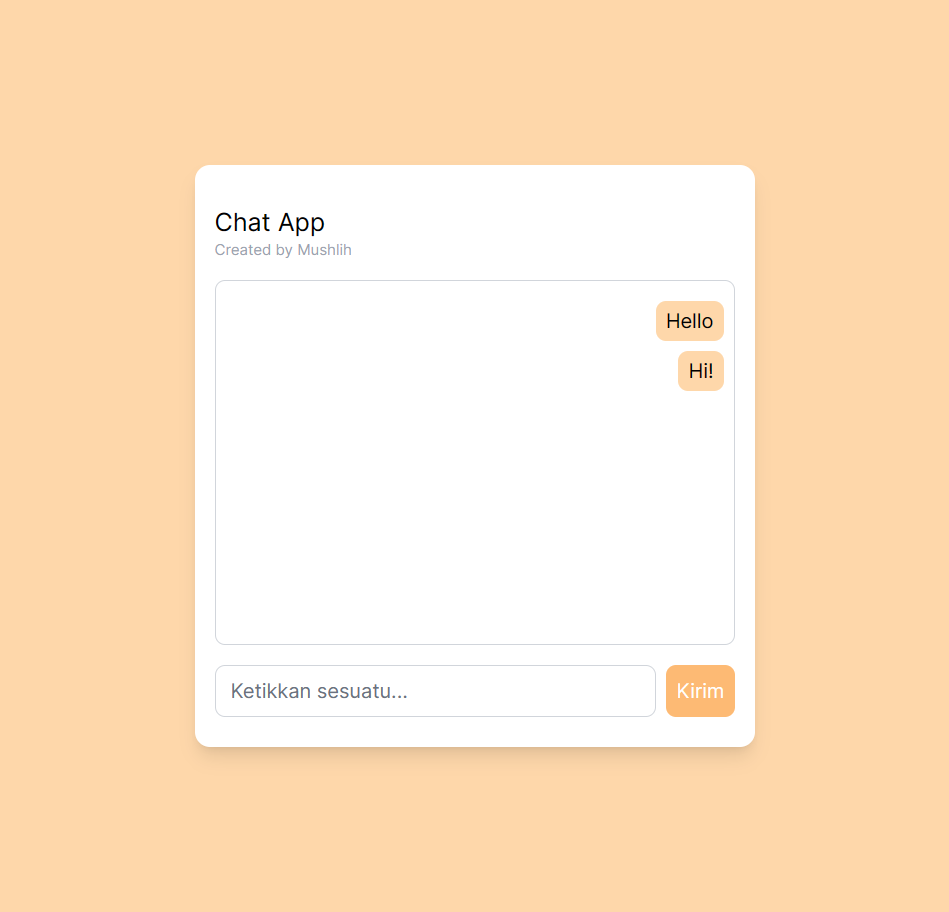

# Chat App using Rails

Chat App - build with ruby on rails and tailwindcss.\n
This my first rails App, I start learning this language yesterday.\n
\n
if you have any suggestion you can contact me.\n
Created on Wednesday, 15 November 2023.

## How to run?

Rails Command:

- Install package: bundle install
- Migrating database: rails db:migrate
- Seeding database: rake db:seed
- Run server: rails s -e dev
  \n
  Tailwindcss Command:
- Tailwind dev mode: rails tailwindcss:watch
- Tailwind buid: rails tailwindcss:build

## Documentation

This README would normally document whatever steps are necessary to get the
application up and running.

Things you may want to cover:

- Ruby version

- System dependencies

- Configuration

- Database creation

- Database initialization

- How to run the test suite

- Services (job queues, cache servers, search engines, etc.)

- Deployment instructions

- ...
